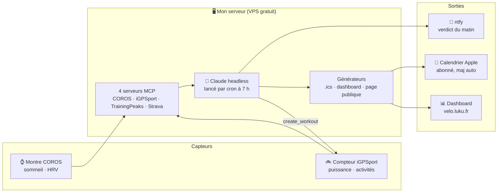

# 🚴 Coach vélo IA — autonome, sur ton propre serveur

> Un coach qui lit ma montre et mon compteur, analyse mes nuits, **décide ma séance chaque matin**, pousse les entraînements sur mon GPS, et tient à jour mon calendrier Apple et mon dashboard. Tout seul. Construit **en une soirée** en dialoguant avec [Claude Code](https://claude.com/claude-code).


**Démo publique : [velo.luku.fr/pub](https://velo.luku.fr/pub/)** — stats réelles, mises à jour chaque matin.

---

## Une journée avec le coach

```
23 h ── Je dors          → la montre COROS enregistre sommeil, HRV, récupération
7 h 00 ─ Claude analyse  → nuit + fatigue + séance prévue au programme
7 h 01 ─ Le verdict      → notification ntfy : ✅ maintenue · ⚠️ allégée · 🛑 repos
18 h ── Je roule guidé   → le compteur iGPSport affiche les watts cibles
19 h 30  Tout se met à jour → calendrier Apple, dashboard, sans rien faire
```

## Architecture



Le principe : **Claude n'intervient que là où il apporte quelque chose** (analyser, décider, rédiger). Le reste est du cron, du nginx et des scripts Python bien ennuyeux. Les règles de décision vivent dans un prompt en français, modifiables sans coder — et Claude ne peut **que** lire et notifier.

## Ce qu'il y a dans ce repo

| Fichier | Rôle |
|---|---|
| [`server/monitoring/coach-velo.prompt.md`](server/monitoring/coach-velo.prompt.md) | Le cerveau : les règles de décision du verdict matinal |
| [`server/monitoring/coach-velo-collect.sh`](server/monitoring/coach-velo-collect.sh) | Collecte les métriques COROS de la nuit (JSON) |
| [`server/monitoring/coach-velo-ics.py`](server/monitoring/coach-velo-ics.py) | Génère le calendrier .ics abonné (verdicts inclus) |
| [`server/monitoring/coach-velo-dashboard.py`](server/monitoring/coach-velo-dashboard.py) | Dashboard privé (graphique forme/fatigue façon TrainingPeaks, en français humain) |
| [`server/monitoring/coach-velo-pub.py`](server/monitoring/coach-velo-pub.py) | Page publique « vitrine » pour les réseaux |
| [`server/monitoring/coach-velo-plan.tsv`](server/monitoring/coach-velo-plan.tsv) | Le programme 12 semaines, une ligne par séance |
| [`mcp/push_program.py`](mcp/push_program.py) | Génère et pousse les 17 séances sur le compteur iGPSport (cibles en %FTP) |
| [`server/crontab.example`](server/crontab.example) | Les 3 crons qui font tourner le tout |
| [`server/docker/docker-compose.example.yml`](server/docker/docker-compose.example.yml) | Hébergement : racine protégée, `/pub` et `/cal-*` ouverts |
| [`server/secrets.example/`](server/secrets.example/) | Modèles des fichiers d'identifiants (à remplir, `chmod 600`) |

## Installation express

### 1. Les connecteurs MCP (les données)

```bash
# uv fournit un Python moderne même sur un vieux système
curl -LsSf https://astral.sh/uv/install.sh | sh
mkdir -p ~/mcp/secrets && chmod 700 ~/mcp/secrets

# COROS (sommeil, HRV) — API non officielle
git clone https://github.com/cygnusb/coros-mcp ~/mcp/coros-mcp
cd ~/mcp/coros-mcp && uv venv --python 3.12 && uv pip install -e .

# TrainingPeaks (CTL/ATL/TSB) — cookie de session
git clone https://github.com/JamsusMaximus/trainingpeaks-mcp ~/mcp/trainingpeaks-mcp
cd ~/mcp/trainingpeaks-mcp && uv venv --python 3.12 && uv pip install -e .

# iGPSport (activités + push de séances !) — PyPI
mkdir ~/mcp/igpsport-mcp && cd ~/mcp/igpsport-mcp
uv venv --python 3.12 && uv pip install igpsport-mcp "mcp<2"
```

Remplir les fichiers de `server/secrets.example/` dans `~/mcp/secrets/`, créer un wrapper `run.sh` par MCP (voir [`mcp/run.sh`](mcp/run.sh)), puis :

```bash
claude mcp add --scope user coros -- bash ~/mcp/coros-mcp/run.sh
claude mcp add --scope user igpsport -- bash ~/mcp/igpsport-mcp/run.sh
claude mcp add --scope user trainingpeaks -- bash ~/mcp/trainingpeaks-mcp/run.sh
claude mcp list   # tout doit être « Connected »
```

Strava a un MCP officiel (lecture) connecté via claude.ai.

### 2. Le programme sur le compteur

Adapter `mcp/push_program.py` (ta FTP est lue depuis l'env) et l'exécuter : les 17 séances apparaissent dans l'appli iGPSport, prêtes à synchroniser sur le compteur.

### 3. Le coach du matin

Copier les scripts de `server/monitoring/`, adapter le plan, créer un topic ntfy **avec suffixe aléatoire**, et poser le cron :

```cron
0 7 * * * grep -qs "^$(date +\%F)" ~/monitoring/coach-velo-plan.tsv \
  && claude -p "$(cat ~/monitoring/coach-velo.prompt.md)" \
       --allowedTools "Bash,Read,Edit,Write,Glob,Grep" --max-turns 100
```

### 4. Calendrier + pages

Un conteneur nginx derrière Traefik sert le tout (voir le compose d'exemple). S'abonner au calendrier : Réglages → Calendrier → **Ajouter un cal. avec abonnement** → l'URL du `.ics`.

## Pas de serveur ?

**Ça marche à 90 % avec juste Claude Code sur ton PC** : les MCP tournent en local, le planificateur de tâches de l'OS lance le coach à 7 h (ordi allumé), et des GitHub Pages gratuites hébergent le calendrier et le dashboard. Le serveur n'apporte que deux choses : ça tourne ordi éteint, et tu peux protéger tes données santé par mot de passe.

## ⚠️ Les pièges (vécus)

- **COROS** refuse le login si le compte vient d'Apple/Google → définir un mot de passe dans l'appli.
- **iGPSport** tape sur le serveur chinois par défaut → `IGPSPORT_REGION=intl` obligatoire, sinon 403.
- **igpsport-mcp** exige `mcp<2` (import supprimé dans le SDK v2) ; son `list_workouts` renvoie 0 sur le serveur international → passer par l'appel HTTP brut pour lister/supprimer (voir `push_program.py`), sinon on empile des doublons.
- Le **cookie TrainingPeaks** expire au bout de quelques semaines → prévoir de le renouveler.
- Les cibles sont compilées en **watts absolus** → re-pousser les séances après chaque test FTP.
- Dans un `.ics`, les retours à la ligne sont des `\n` **littéraux** — et les backslashes se font manger via ssh + heredoc.
- Les `$` d'un hash htpasswd se **doublent** (`$$`) dans docker-compose.
- Vérifier le **rendu à l'écran**, pas la présence dans le HTML (une carte de 0 px de large est « présente » mais invisible).

## Avertissement

Les connecteurs COROS, iGPSport et TrainingPeaks reposent sur des **API non officielles** : elles peuvent casser sans préavis. Ce repo documente une installation personnelle — pas un produit. Rien ici ne constitue un avis médical ou d'entraînement professionnel.

## Licence

MIT — fais-en ce que tu veux, une étoile ⭐ fait toujours plaisir.

---

*Construit en dialoguant avec Claude Code : chaque brique écrite, testée sur le serveur et corrigée dans la conversation. Le rôle de l'humain : dire ce qu'il veut, donner les accès… et pédaler.*
